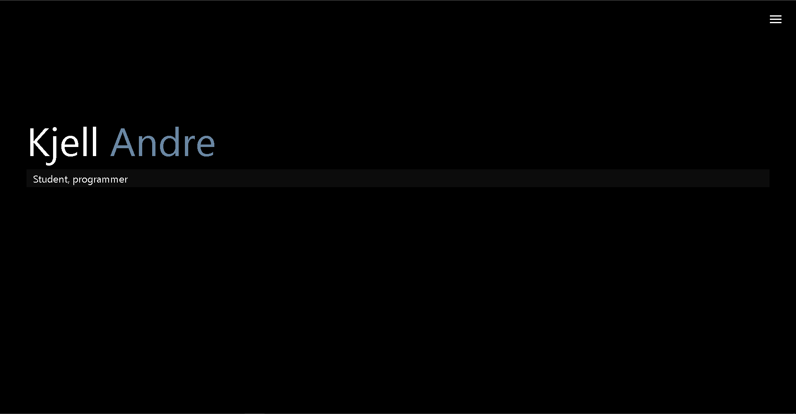

# this is my portfolio website, I coded it myself in html, css and javascript. my work is listed under "My work"
## I have some projects that I'm currently working on, but I will add them when I'm done

